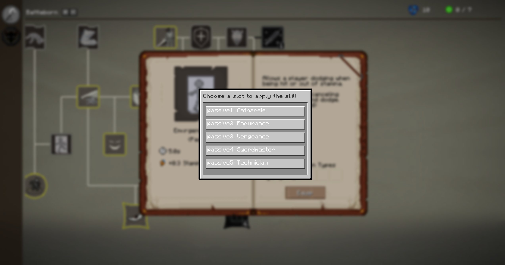

# Epic Fight: More Skill Slots

A simple mod that adds additional skill slots to the [Epic Fight](https://modrinth.com/mod/epic-fight) mod:

* 2 extra passive slots (5 total)
* 1 extra identity slot (2 total)

This mod is particularly useful for modpacks that include mods such as  
[Weapons of Miracles](https://modrinth.com/mod/weapons-of-miracles), [Dodge Parry Reward](https://www.curseforge.com/minecraft/mc-mods/epic-fight-dodge-parry-reward),
and [Nightfall](https://www.curseforge.com/minecraft/mc-mods/epicfight-nightfall).

These mods add many passive skills. Additionally, if you are using mods that make survival more challenging, without
these extra slots you will be limited to 3 passive skills, which can restrict your build options.

## Existing Game Saves

You can install this mod and load existing worlds without losing your current skills.  
However, if you remove the mod and then load an existing world, the extra skill slots will be removed.

## Compatibility

Tested with [Epic Fight: Skill Tree](https://modrinth.com/mod/epic-fight-skill-tree) and works as expected.

## Limitations

Currently, this mod does not provide a configuration option to adjust the extra skill slots.  
However, adding this feature should be straightforward.

## Bug reports

This isn't an official Epic Fight addon, so any issues should be reported
to [this mod issue tracker](https://github.com/EchoEllet/EpicFightMoreSkillSlots/issues)
rather than to the Epic Fight team.

## Disclaimer

> [!WARNING]
> **This mod is NOT AN OFFICIAL MINECRAFT PRODUCT.  
> It is NOT APPROVED BY OR ASSOCIATED WITH MOJANG OR MICROSOFT.**

> [!NOTE]
> **This mod is not affiliated with the [Epic Fight Team](https://github.com/Epic-Fight).**
